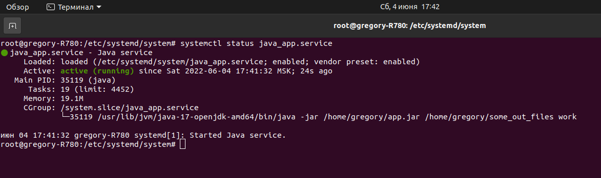
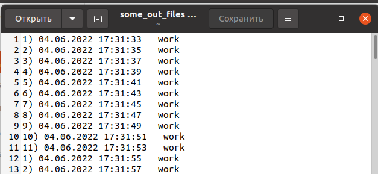
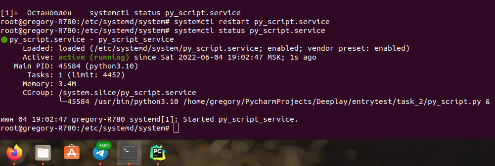

# Задание II
___
Файл java_app.service необходимо копировать в папку: "/etc/systemd/system/"
Даем разрешение на запуск юнита, запускаем и смотрим статус:
```bash
systemctl enable java_app.service
systemctl start java_app.service
systemctl status my_daemon.service
```



Для приминения изменений в Юнит-файле:
```bash
systemctl daemon-reload
```

Остается проверить some_out_file и радоваться жизни!


___

# Бунус к заданию
## Так как я Python разработчик я решил написать свой python-демон.
___
Что бы протестировать скрипт py_script.py в фоне введите команду:
```bash
python3 script.py &
```
Запустится программа в фоновом режиме, которая считает до 10 бесконечно и записывает в log.txt отсчеты.
Для остановки программы использовать:
```bash
kill PID
```
Главное не запускать программу с пустым log.txt, а записать начальное значение "1". !!! 

Далее делаем с файлом py_script.service то же самое , что и в примере с java.


___

